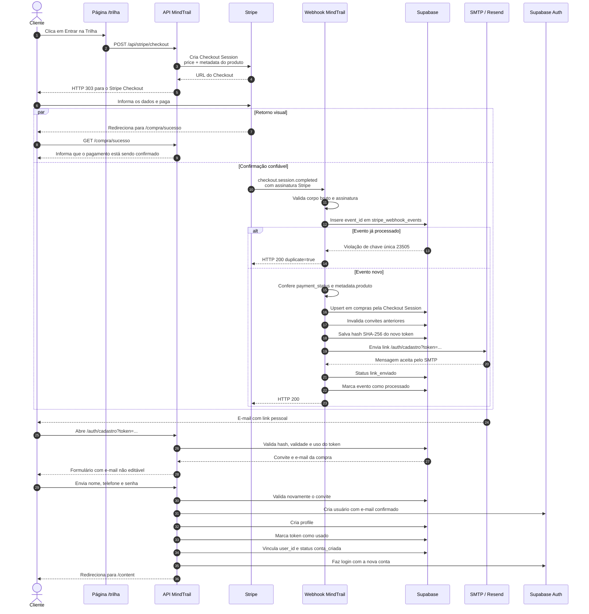
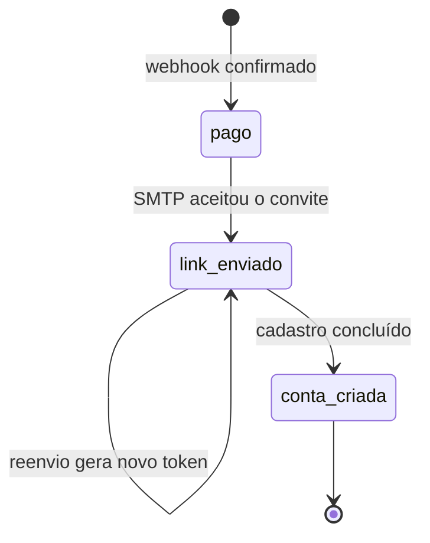

# Fluxo de Checkout Stripe e Liberação de Acesso

Este documento descreve o fluxo completo implementado no projeto, desde o clique no botão de compra até a criação da conta do cliente na plataforma.

## Visão geral

O fluxo é dividido em duas partes independentes:

1. O navegador do cliente inicia o Checkout e, ao final, é redirecionado para uma página de sucesso.
2. O Stripe confirma o pagamento diretamente ao servidor por webhook.

O webhook é a fonte confiável da confirmação. A página de sucesso não grava a compra nem libera acesso, pois o cliente pode fechar o navegador antes do redirecionamento.

## Diagrama de interação



## 1. Entrada pelo site

A página `/trilha` é servida pelo arquivo `public/trilha/index.html`. Os botões de compra são formulários HTML que enviam:

```http
POST /api/stripe/checkout
```

Não há captura de cartão no projeto. Os dados de pagamento são coletados na página hospedada pelo Stripe.

Arquivos envolvidos:

- `public/trilha/index.html`
- `next.config.mjs`, que reescreve `/trilha` para o arquivo estático

## 2. Criação da Checkout Session

A rota `app/api/stripe/checkout/route.ts`:

1. Obtém o preço por `STRIPE_PRICE_ID`.
2. Inicializa o cliente com `STRIPE_SECRET_KEY`.
3. Cria uma Checkout Session no modo `payment`.
4. Define uma unidade do preço configurado.
5. Solicita a criação de um Stripe Customer.
6. Adiciona `produto=trilha-produtividade` aos metadados.
7. Configura as URLs de sucesso e cancelamento.
8. Redireciona o navegador para a URL do Stripe com HTTP `303`.

O cliente Stripe fica centralizado em `lib/stripe.ts` e só é criado no servidor.

## 3. Página de sucesso

Depois do pagamento, o Stripe redireciona o navegador para:

```text
/compra/sucesso?session_id={CHECKOUT_SESSION_ID}
```

A página `app/compra/sucesso/page.tsx` é somente informativa. Ela não consulta o pagamento e não libera acesso.

Essa separação evita depender do navegador para concluir o processamento da compra.

## 4. Recebimento do webhook

A rota `app/api/stripe/webhook/route.ts` recebe eventos do Stripe.

### Validação da assinatura

A implementação lê o corpo sem alterações por meio de `request.text()` e valida:

- O header `stripe-signature`.
- O corpo bruto da requisição.
- O segredo `STRIPE_WEBHOOK_SECRET` do endpoint.

Uma assinatura inválida recebe HTTP `400` e não chega ao banco.

Cada ambiente possui um segredo próprio:

- O segredo gerado por `stripe listen` vale apenas para o ambiente local.
- O endpoint de Preview possui outro `whsec_...`.
- O endpoint de Produção deve possuir seu próprio `whsec_...`.

### Eventos aceitos

O sistema processa:

- `checkout.session.completed`
- `checkout.session.async_payment_succeeded`

Outros eventos recebem HTTP `200`, mas não executam regras de compra.

## 5. Idempotência e retries

Antes de processar uma compra, o webhook tenta inserir o evento em `stripe_webhook_events`.

O campo `event_id` é uma chave primária. Se o Stripe reenviar o mesmo evento, o PostgreSQL retorna o código `23505` e a aplicação responde com sucesso sem executar o fluxo novamente.

Se ocorrer uma falha durante o processamento:

1. O registro do evento é removido.
2. O endpoint retorna HTTP `500`.
3. O Stripe pode tentar entregar o evento novamente.

Isso permite recuperação de falhas temporárias no Supabase ou no serviço de e-mail.

## 6. Registro da compra

O processamento continua somente quando:

```text
payment_status = paid
metadata.produto = trilha-produtividade
```

O e-mail é normalizado com `trim()` e `toLowerCase()`.

A tabela `compras` recebe um `upsert` usando `stripe_checkout_session_id` como identificador único. São armazenados:

- Checkout Session.
- Payment Intent.
- Stripe Customer.
- Produto.
- E-mail e nome do cliente.
- Valor total e moeda.
- Data do pagamento.
- Estado atual do acesso.

A compra começa no estado `pago`.

## 7. Token de acesso

As regras de convite ficam em `lib/acesso-compra.ts`.

O sistema:

1. Gera 32 bytes aleatórios com `randomBytes`.
2. Converte o valor para Base64 URL-safe.
3. Calcula um hash SHA-256.
4. Salva somente o hash no banco.
5. Envia o token original apenas no link do e-mail.

Antes de criar um convite, tokens anteriores ainda ativos para a mesma compra são marcados com `invalidated_at`.

O prazo padrão é de sete dias e pode ser alterado com:

```text
ACCESS_LINK_TTL_HOURS
```

## 8. Envio do e-mail

O link possui o formato:

```text
{NEXT_PUBLIC_SITE_URL}/auth/cadastro?token={TOKEN}
```

O template é renderizado pelo React Email e enviado pelo Nodemailer por meio de `lib/email.ts`.

Após o SMTP aceitar a mensagem, a compra é atualizada para:

```text
status = link_enviado
access_email_sent_at = data do envio
```

Em desenvolvimento, se o SMTP não estiver configurado, o link é escrito no log. Em produção, a ausência de SMTP gera erro.

## 9. Validação do convite

A página `app/auth/cadastro/page.tsx` chama `buscarConviteCompra()` antes de mostrar o formulário.

O convite precisa:

- Possuir tamanho mínimo válido.
- Ter um hash existente no banco.
- Não estar usado.
- Não estar invalidado.
- Não estar expirado.
- Pertencer a uma compra que ainda não esteja em `conta_criada`.

O e-mail vem diretamente da compra e aparece como somente leitura. O usuário não pode criar a conta com um e-mail diferente daquele informado no Stripe.

## 10. Criação da conta

A Server Action `cadastroPorConvite`, em `app/actions/auth.ts`, valida novamente todo o fluxo no servidor.

Ela executa:

1. Validação dos campos com Zod.
2. Nova validação do token.
3. Criação do usuário no Supabase Auth.
4. Confirmação automática do e-mail, pois ele já foi comprovado pelo link enviado após a compra.
5. Criação ou atualização de `profiles`.
6. Consumo condicional do token com `used_at`.
7. Vínculo do usuário à compra.
8. Alteração da compra para `conta_criada`.
9. Login com a nova senha.
10. Redirecionamento para `/content`.

O consumo usa condições adicionais para impedir que duas requisições utilizem o mesmo token simultaneamente.

## 11. Estados da compra



## 12. Tabelas criadas

### `compras`

Representa o pagamento e o estado da liberação de acesso. A Checkout Session é única e `user_id` referencia `auth.users`.

### `tokens_acesso_compra`

Armazena os hashes dos convites, validade, utilização e invalidação. A exclusão de uma compra remove seus tokens por cascata.

### `stripe_webhook_events`

Registra os eventos recebidos e impede processamento duplicado.

As três tabelas possuem RLS habilitado. As operações privilegiadas usam `SUPABASE_SERVICE_ROLE_KEY` exclusivamente no servidor.

## 13. Reenvio administrativo

A rota `app/api/admin/compras/reenviar-acesso/route.ts` permite o reenvio do convite.

Somente usuários autenticados cujo e-mail esteja em `ADMIN_EMAILS` podem utilizá-la. A rota busca a compra mais recente que ainda não esteja em `conta_criada`, invalida o convite anterior e envia um novo.

## 14. Variáveis de ambiente

### Stripe

```text
STRIPE_SECRET_KEY
STRIPE_PRICE_ID
STRIPE_WEBHOOK_SECRET
```

### Supabase

```text
NEXT_PUBLIC_SUPABASE_URL
NEXT_PUBLIC_SUPABASE_ANON_KEY
SUPABASE_SERVICE_ROLE_KEY
```

### Aplicação

```text
NEXT_PUBLIC_SITE_URL
ACCESS_LINK_TTL_HOURS
ADMIN_EMAILS
```

### SMTP

```text
SMTP_HOST
SMTP_PORT
SMTP_SECURE
SMTP_USER
SMTP_PASS
SMTP_FROM
```

## 15. Comportamento em caso de falha

- Falha ao criar a Checkout Session: o cliente recebe HTTP `500` e não é redirecionado.
- Assinatura inválida: o webhook recebe HTTP `400`.
- Evento duplicado: o webhook recebe HTTP `200` sem novo processamento.
- Falha no banco ou SMTP: o webhook recebe HTTP `500` e o Stripe pode tentar novamente.
- Link expirado, usado ou invalidado: o formulário de cadastro não é exibido.
- Usuário já existente: o cliente é orientado a fazer login.
- Falha de login depois do cadastro: o usuário é enviado para a tela de login com indicação de cadastro concluído.

## 16. Limitações conhecidas

O fluxo possui semântica de entrega de pelo menos uma vez. Se o SMTP aceitar o e-mail e a atualização de `access_email_sent_at` falhar logo depois, um retry pode enviar um novo convite.

A criação de usuário, profile, consumo do token e atualização da compra não ocorre em uma única transação de banco. Se uma etapa intermediária falhar, pode ser necessária intervenção administrativa. O código retorna mensagens específicas para esses casos.

## Mapa dos arquivos

- `public/trilha/index.html`: botões que iniciam o Checkout.
- `app/api/stripe/checkout/route.ts`: criação da Checkout Session.
- `lib/stripe.ts`: cliente Stripe server-side.
- `app/api/stripe/webhook/route.ts`: confirmação e processamento do pagamento.
- `lib/acesso-compra.ts`: criação, envio e validação dos convites.
- `lib/email.ts`: transporte SMTP.
- `lib/email-templates.ts`: renderização do e-mail.
- `app/compra/sucesso/page.tsx`: retorno visual após o Checkout.
- `app/auth/cadastro/page.tsx`: validação inicial do convite.
- `components/CadastroConviteForm.tsx`: formulário de criação de conta.
- `app/actions/auth.ts`: criação e autenticação do usuário.
- `app/api/admin/compras/reenviar-acesso/route.ts`: reenvio administrativo.
- `supabase/migrations/20260928233000_checkout_stripe.sql`: estrutura do banco.
